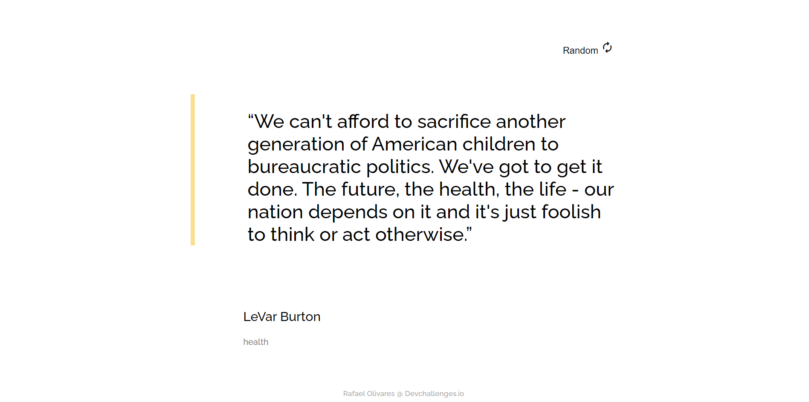

<h1 align="center">Random Quote Generator</h1>

   Solution for a challenge from  <a href="http://devchallenges.io" target="_blank">Devchallenges.io</a>.

  <h3>
    <a href="https://quoty.netlify.app/">
      Demo
    </a>
     | 
    <a href="https://github.com/raolgon/quoty">
      Solution
    </a>
     | 
    <a href="https://devchallenges.io/challenges/8Y3J4ucAMQpSnYTwwWW8">
      Challenge
    </a>
  </h3>

___

## :information_source: Table of Contents

- [Overview](##overview)
  - [Built With](##built-with)
- [Features](##features)
- [Contact](##contact)
- [Acknowledgements](##Acknowledgements)

<!-- OVERVIEW -->

## Overview

___

## :rocket: Technologies

- HTML
- CSS
- JavaScript

### :books: Libraries

- ClipboardJS
- Toast.js

## Features

This application/site was created as a submission to a [DevChallenges](https://devchallenges.io/challenges) challenge. The [challenge](https://devchallenges.io/challenges/8Y3J4ucAMQpSnYTwwWW8) was to build an application to complete the given user stories.

Includes a copy the quote function and a toast message just for fun.

## Acknowledgements

- Learned how to replicate a design.
- Learn how to do Api Fectch
- Learn how to read documentations

## Contact

- GitHub [@raolgon](https://github.com/raolgon)
- Twitter [@Rafa_Oli](https://twitter.com/RafaOlivares77)
- Discord yotta#8564

___